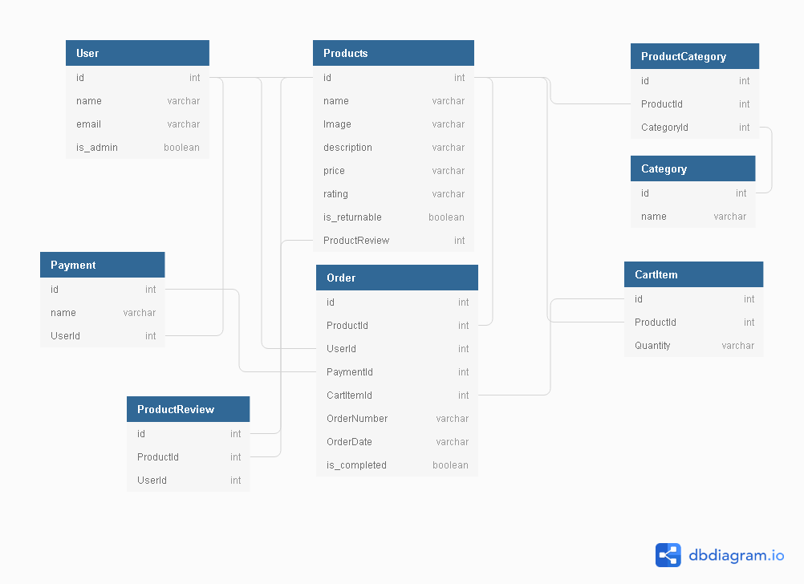
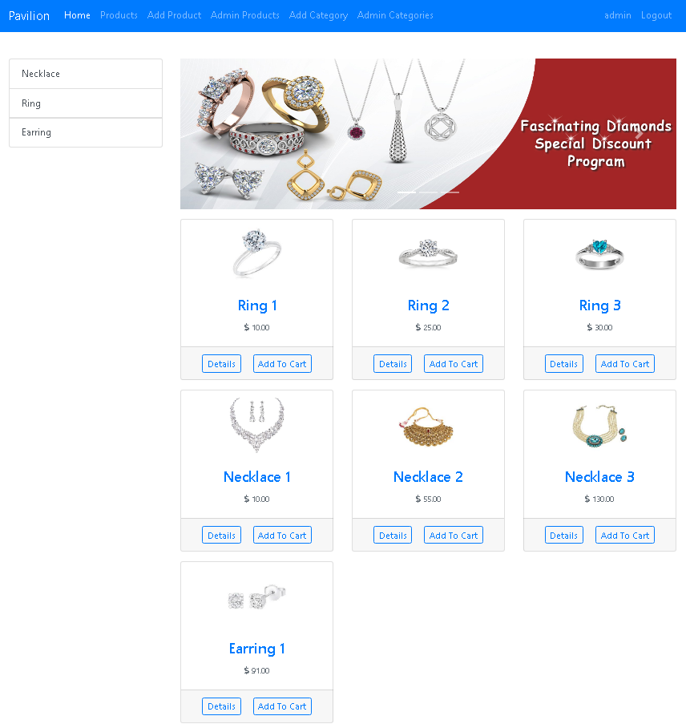
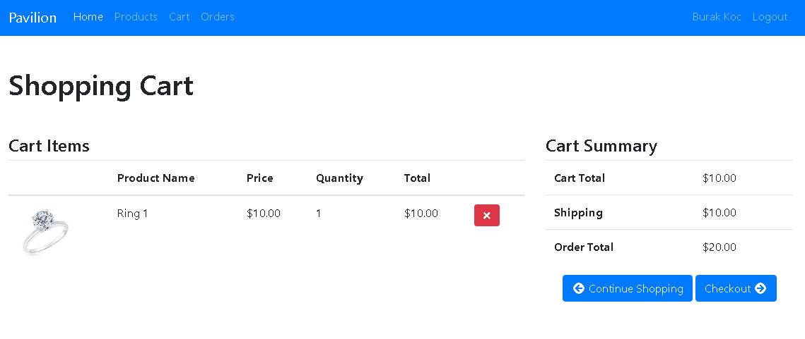
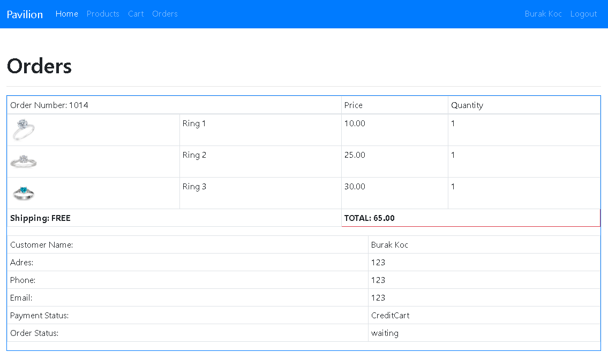

# Pavilion Jewelry Store

<h3>Diagram</h3>

<h3>Description:</h3>

Pavilion is an online jewelry store where shoppers can buy various jewelry products. Administrators of the
application can add new products and new categories and view the orders of the customers. Shoppers can
create accounts by verifying their e-mails and add payment methods to complete their orders.

<h3>Technologies, frameworks and languages used:</h3>
<ul>
<li>Visual Studio 2019
<li>ASP.NET Core
<li>SQL Server
<li>MVC, Razor Pages and API
<li>Middleware (Providing functionality to the HTTP Request pipeline)
<li>Entity Framework (To crate and communicate with a database)
<li>Dependency Injection (To inject objects into constructors)
<li>Bootstrap (To style and create a responsive design)
<li>LINQ (To query the database)
<li>Tag Helper (to clean up the HTML and enable reuse)
<li>HTML Helper methods (to clean up HTML and enable reuse)
<li>Partial views (to clean up iews and enable re-use)
<li>Iyizco Payment (To receive payments from the customers)
<li>SendGrid (To confirm accounts and forgot password confirmation)
</ul>

<h4>Admin Panel</h4>

<h4>Shoppers Cart</h4>

<h4>Shoppers Orders</h4>

